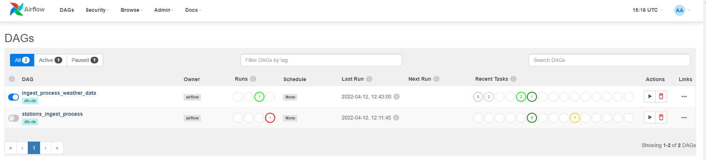

 #### Setup
 
 In order to allow a correct run of the Airflow this setup had to be made:
 
  [Airflow Setup with Docker, through official guidelines](MainSETUP.md)

 #### Execution
 
  1. The image was built but only on the first time (it was necessary to rebuilt in case of changes of DockerFile):
     ```shell
     docker-compose build
     ```

 2. I initialized the Airflow scheduler, DB, and other config
    ```shell
    docker-compose up airflow-init
    ```

 3. Kick up the all the services from the container:
    ```shell
    docker-compose up
    ```

 4. Login to Airflow web UI on `localhost:8080` with default creds: `airflow/airflow`



 5. Run my DAGs on the Web Console.

 6. In case of need I changed the Python file with the DAG and the changes are applied in the Airflow GUI in seconds.

 

At the end of the process I just shut down the container/s:
    ```shell
    docker-compose down
    ```


